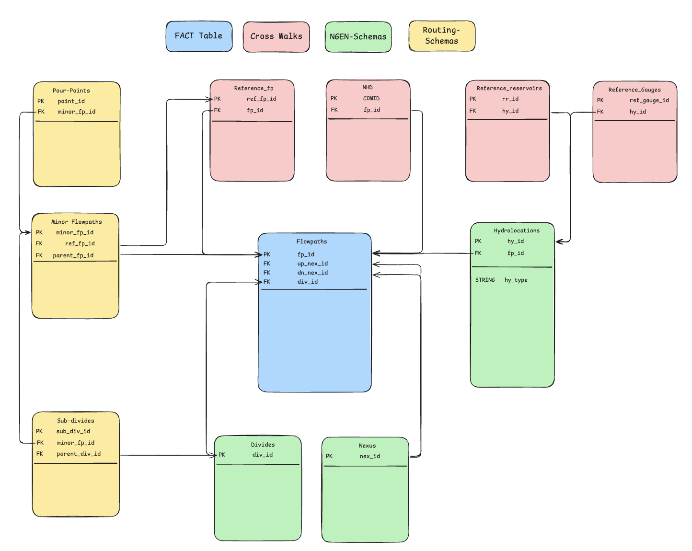

# hydrofabric-builds
Building Hydrofabric &amp; Processing Ancillary Data


### Getting Started
This repo is managed through [UV](https://docs.astral.sh/uv/getting-started/installation/) and can be installed through:
```sh
uv sync
```

### Development
To ensure that hydrofabric-builds follows the specified structure, be sure to install the local dev dependencies and run `uv run pre-commit install`

### Documentation
To build the user guide documentation for Icefabric locally, run the following commands:
```sh
uv sync --extra docs
uv run mkdocs serve -a localhost:8080
```
Docs will be spun up at localhost:8080/

#### Proposed Schema

The following schema is the proposed data model for NGWPC hydrofabric datasets produced by this repo.



##### Flowpaths FACT Table

The central table (or FACT Table) is `Flowpaths`. Each `flowpath` has a downstream, and upstream `nexus` point, allowing for traversal of a river network through a single table. Additionally, there is a 1:1 relationship between `flowpath` and `divide`.

##### NGEN Schema

The tables highlighted in green are the infomation needed for lumped modeling to take place. Lumped models require attributes, the shape of the `divide` that is being modeled, and a `nexus` point for flow to be aggregated to.

##### Routing Schema

The tables highlighted in yellow are the information needed for routing at a high resolution. T-Route is expected to run at a fine-scale (~300m segments) with many `minor_flowpaths`. There should be a many -> one relationship between `minor_flowpaths` and `flowpaths`, with some `minor flowpaths` not being represented in the `flowpaths` table. These non-represented `flowpaths` are not routed on, but used in post-processing.

##### Reference Crosswalks

The NGWPC Hydrofabric is build using many reference materials:
- Reference Flowpaths
- Reference Reservoirs
- Reference POIs
- NHD+ COMIDs

To ensure `flowpaths` can be mapped to back to the materials that created them, each of the reference materials is mapped to `flowpaths`, `hydrolocations`, and `minor flowpaths`.
