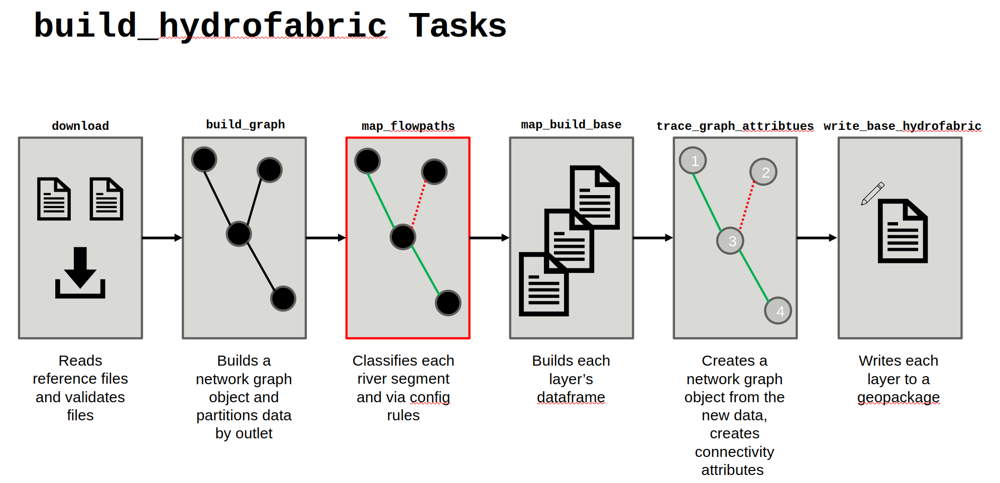
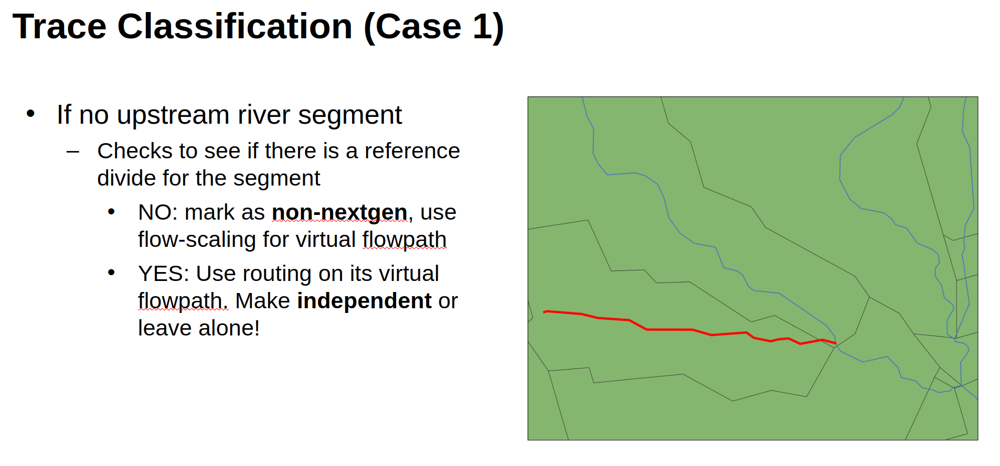
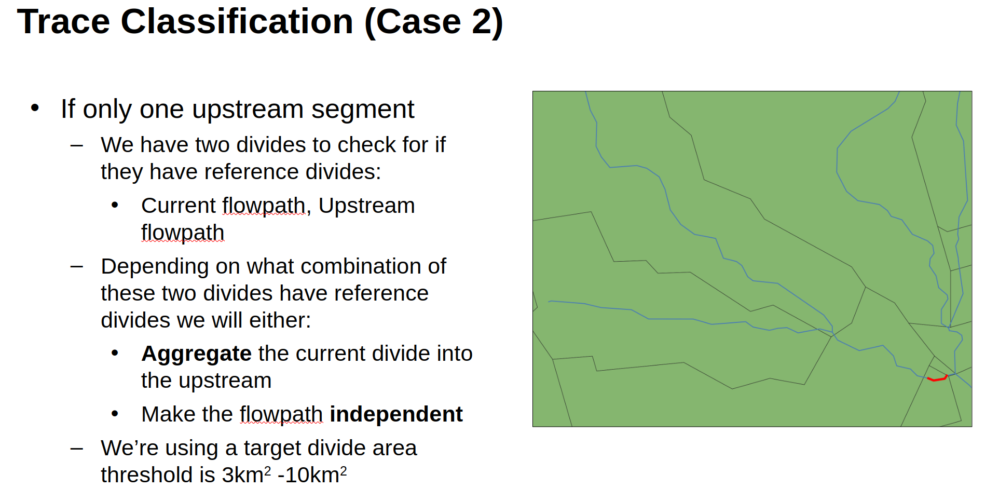
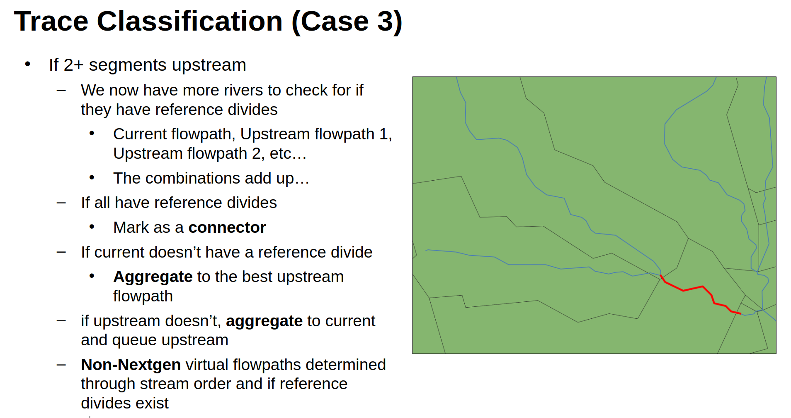
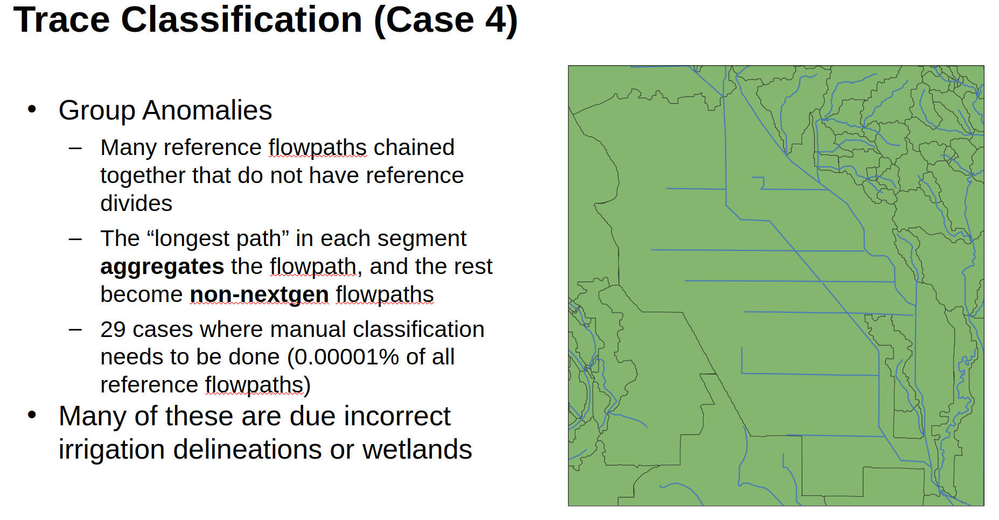
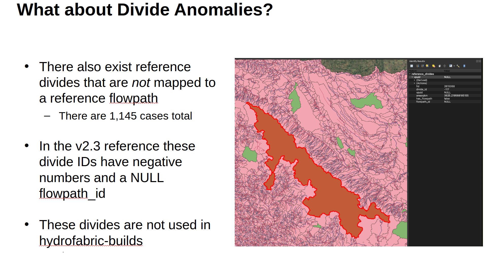
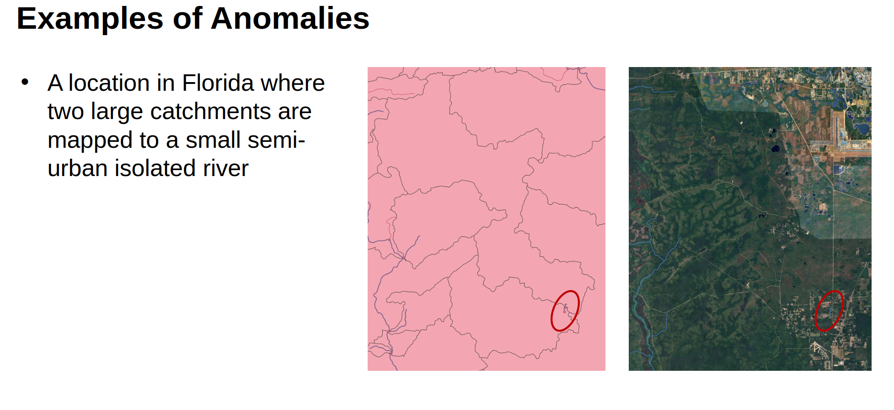
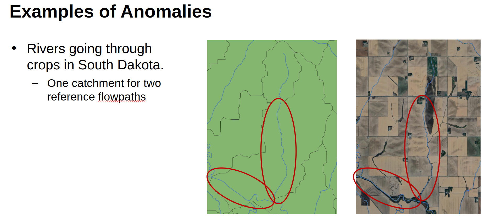
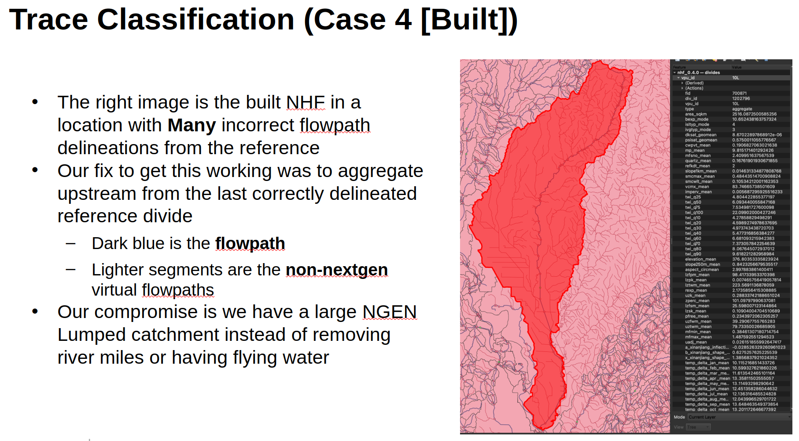

# Building the Network

## Overview
Building the NHF network consists of 7 steps.
1. download: loading the reference parquets
2. build_graph: constructing rustworkx graph objectsfrom flowpaths and breaking into partitions by outlet
3. map_flowpaths: tracing and aggregating flowpaths for each partition
4. map_build_base: building base hydrofabric layer by converting classifications and aggregations into flowpaths, divides, and nexus layers per partition
5. reduce_base: concatenating hydrofabric layers into an aggregated dataset with single unified layers for flowpaths, divides, and nexus points
6. trace_attributes: tracing each outlet partition with existing graph to build to build upstream dictionary from nexus connections and creating attributes for drainage basins
7. write_base: writing the entire layer to GPKG

The code logic can be traced via `scripts/hf_runner.py` main function as each step is called and built. Each step returns a dictionary of values needed for the next step.

## Tracing Logic
The tracing logic is as follows:

Classification Rules:

There are four main rules for classification:
1. No upstream river segments.
2. One upstream river segment.
3. 2+ upstream river segments.
4. Group Anomalies.

Case 1:

If no upstream river segment
Checks to see if there is a reference divide for the segment
NO: mark as non-nextgen, use flow-scaling for virtual flowpath
YES: Use routing on its virtual flowpath. Make independent or leave alone!

Case 2:
If only one upstream segment
We have two divides to check for if they have reference divides:
Current flowpath, Upstream flowpath
Depending on what combination of these two divides have reference divides we will either:
Aggregate the current divide into the upstream
Make the flowpath independent
We’re using a target divide area threshold is 3km2 -10km2

Case 3:
If 2+ segments upstream
We now have more rivers to check for if they have reference divides
Current flowpath, Upstream flowpath 1, Upstream flowpath 2, etc…
The combinations add up…
If all have reference divides
Mark as a connector
If current doesn’t have a reference divide
Aggregate to the best upstream flowpath
if upstream doesn’t, aggregate to current and queue upstream
Non-Nextgen virtual flowpaths determined through stream order and if reference divides exist

Group Anomalies
Many reference flowpaths chained together that do not have reference divides
The “longest path” in each segment aggregates the flowpath, and the rest become non-nextgen flowpaths
29 cases where manual classification needs to be done (0.00001% of all reference flowpaths)
Many of these are due incorrect irrigation delineations or wetlands

### Anomalies
There are anomalies to deal with in the HF because not every reference flowpath has a reference divide associated with it.

Example: Divide Anomalies
There also exist reference divides that are not mapped to a reference flowpath
There are 1,145 cases total

In the v2.3 reference these divide IDs have negative numbers and a NULL flowpath_id

These divides are not used in hydrofabric-builds

Example: A location in Florida where two large catchments are mapped to a small semi-urban isolated river

Example: Rivers going through crops in South Dakota.
One catchment for two reference flowpaths

Example:
The right image is the built NHF in a location with Many incorrect flowpath delineations from the reference
Our fix to get this working was to aggregate upstream from the last correctly delineated reference divide
Dark blue is the flowpath
Lighter segments are the non-nextgen virtual flowpaths
Our compromise is we have a large NGEN Lumped catchment instead of removing river miles or having flying water

